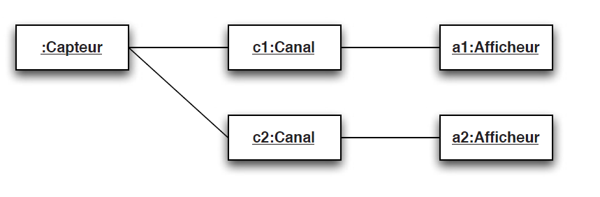
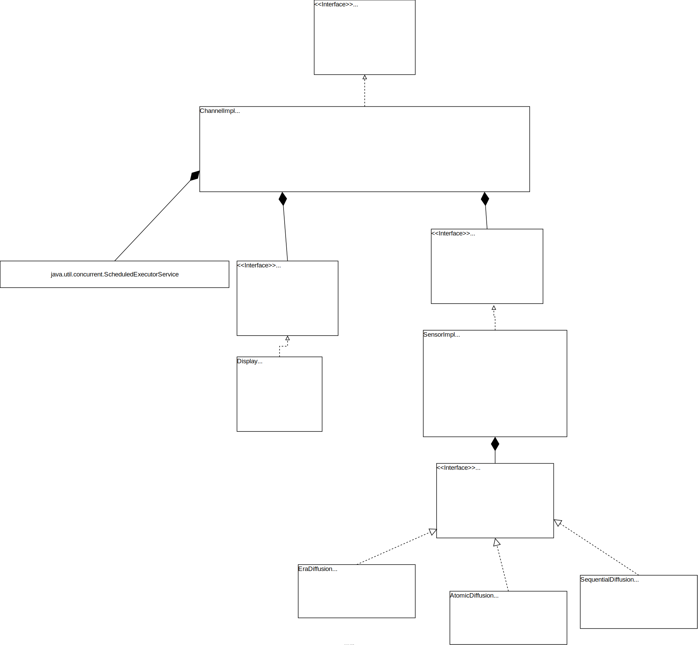

# TP OBSERVER AOC

## Introduction
The goal is to build a sensor data dissemination service. 

The solution you will build must be based on the Active Object design pattern.

The implementation will allow to broadcast a stream of values to subscriber objects running in different threads from the service source.
The objective of this tutorial being the parallel implementation of Observer, the broadcasted data will be an increasing sequence of integers.

The counter will be incremented at fixed intervals.

The transmission of the information to the subscribers of the service will use a channel with a random transmission delay.

The architecture will therefore include:
- An active source (sensor), whose value evolves periodically
- A set of transmission channels with variable delays
- A set of Observer broadcast policies



## Documentation

### Documentation folder

The documentation folder contains subfolders each having documentation :

#### Assets
The assets folder contains the different diagrams such as the class diagram or the sequence diagram.

#### Executable
The executable folder contains an executable of the application as well as .bat and .sh scripts to execute it.

#### Javadoc
The javadoc contains the generated javadoc.


### Class diagram



### Sequence diagrams

#### Era Diffusion


### Atomic Diffusion


#### Sequential Diffusion


## System description

### Era Diffusion
```java
public void execute() {
    // Update the displays
    for (Channel c : this.sensor.channels) {
    c.update();
    }
}
```
The action of era diffusion is simple, this diffusion is not blocking and just update the display.

### Atomic Diffusion
```java
public void execute() {
        // Update the displays
        ArrayList<Future<?>> futures = new ArrayList<>();
        for (Channel c : this.sensor.channels) {
            futures.add(c.update());
        }

        // Wait end of each future
        futures.forEach(i -> {
            try {
                i.get();
            } catch (InterruptedException | ExecutionException e) {
                e.printStackTrace();
            }
        });
    }
```

Atomic diffusion works like Era diffusion, however after calling the update() method for all channels, a second loop lock and waits for the reception of the new sensor value by all displays.

### Sequential Diffusion
```java
public void execute() {
    Map<Future<?>, Channel> futures = new HashMap<>();

    // List of future from update method
    for (Channel c : this.sensor.channels) {
        futures.put(c.update(), c);
    }

    // Nb ended futures
    int ended = 0;
    // Loop to get futures, when all futures are received loop is break
    while (ended < futures.size()) {
        ended = 0;
        for (Map.Entry<Future<?>, Channel> entry : futures.entrySet()) {
            Future<?> f = entry.getKey();
            Channel c = entry.getValue();
            // When a future is done
            if (f.isDone()) {
                // Get value of display on done future
                int best_value = c.getDisplay().getValue();
                // For every display, if current best value is > than current
                // Set new display value as current best_value
                for (Channel tmp_c : futures.values()) {
                    if (best_value > tmp_c.getDisplay().getValue()) {
                        tmp_c.getDisplay().setValue(best_value);
                    }
                }
                // Increment ended futures
                ended++;
            }
        }
    }
}
```

The sequential distribution is more complex.

After calling the update method on all channels, a non-blocking while loop waits for the end of all futures.
When a future is finished, if the value of the last display is greater than the last received value, the value of all displays is updated with the new value.

## Tests
A JUnit test is available for each broadcast
For each test, it is possible to modify N which represents the amount of repetition for test loop.

All tests are validated.

### Era Diffusion
```java
@Test
@DisplayName("EraDiffusion")
void testEraDiffusion() throws InterruptedException {
    for (int i = 1; i <= N; i++) {
        sensor.tick();
        assertEquals(sensor.getValue(), i);
        for (SensorObserver display : displays) {
            // 3000 is max delay for channel
            Thread.sleep(3000);
            assertEquals(display.getValue(), i);
        }
    }
}
```

This test consists in verifying that the sensor value increments for N tick

Then a delay of 3000ms (equivalent to the maximum delay of the data transfer in the channel) allows to check the new display value.

### Atomic Diffusion

```java
void testAtomicDiffusion() {
    for (int i = 1; i <= N; i++) {
        sensor.tick();
        assertEquals(sensor.getValue(), i);
        for (SensorObserver display : displays) {
            assertEquals(display.getValue(), i);
        }
    }
}
```

This test consists in verifying that the sensor value increments for N tick.

Then we check directly that each display has received the value of the sensor.


### Sequential Diffusion

```java
void testSequentialDiffusion() {
    int best_value;
    for (int i = 1; i <= N; i++) {
        sensor.tick();
        best_value = sensor.getValue();
        assertEquals(sensor.getValue(), i);
        for (SensorObserver display : displays) {
            assertEquals(display.getValue(), best_value);
        }
    }
}
```

This test consists in verifying that the sensor value increments for N tick

Then we check that for each display, the value is equal to the latest value received.

